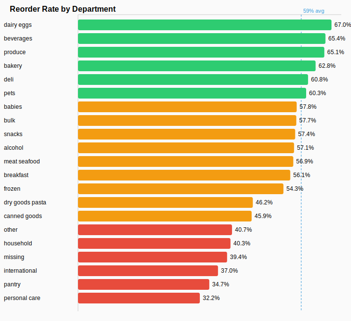
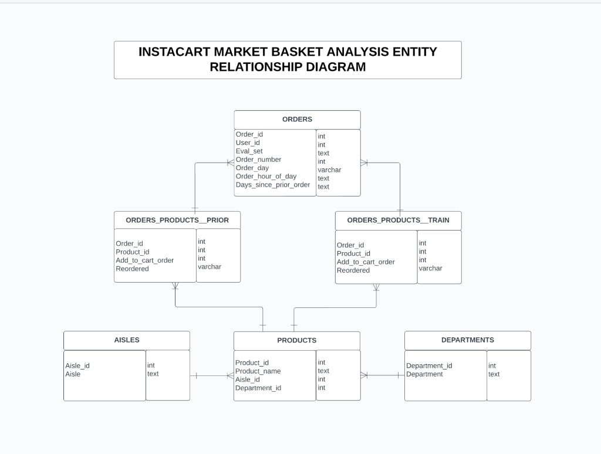
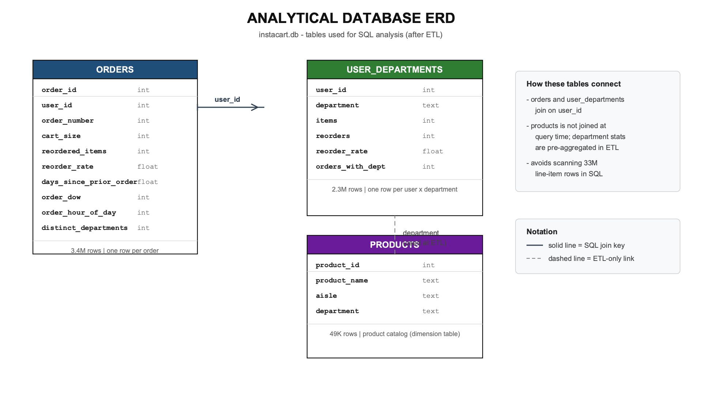
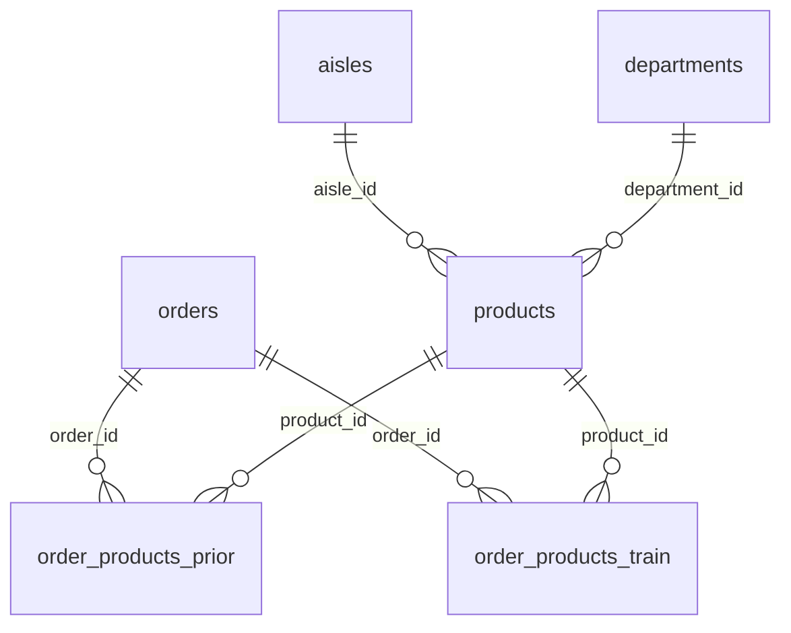
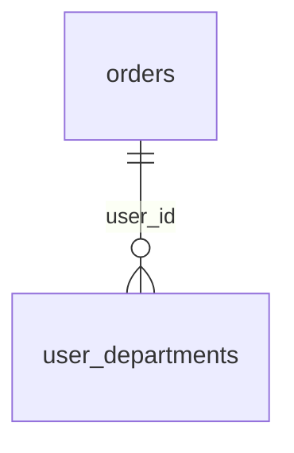

# Instacart Customer Behavior Case Study

## The question I set out to answer

Instacart makes money when people come back and reorder. So I wanted to answer two things:

1. **Who looks like they're about to stop ordering?**
2. **Which product categories actually bring people back?**

I used SQL on the public Instacart dataset — 3.4 million orders across 206,209 users — and built a small pipeline to get from raw CSVs to something I could actually query without waiting ten minutes per join.

---

## What I found

### About 1 in 4 customers are showing early churn signals

47,109 users (22.8%) took noticeably longer to place their most recent order than they usually do. Their latest gap was at least 1.5× their own historical average. They haven't disappeared yet — but something changed.

If I were advising Instacart, I'd send this group a re-engagement nudge now — maybe a discount on whatever they reorder most — before they go quiet for good.

---

### Staples drive repeat behavior; personal care doesn't

People reorder staples constantly. Dairy & eggs (67%), beverages (65%), and produce (65%) have the highest repeat rates. Personal care (32%) and pantry items (35%) are much lower. Across the whole dataset, 59% of purchased items are reorders.



That lines up with how people actually shop groceries — you rebuy milk every week, not shampoo. Replenishment reminders make sense for dairy and produce. For personal care, discovery-style recommendations are probably a better fit.

---

### Loyalty builds over time

Shoppers with 16+ orders reorder 67% of their items. Shoppers with only 4–6 orders reorder just 29%. There's a real jump once someone crosses into the 7–15 order range (45% reorder rate).

Worth paying attention to orders 4 through 7 — that's where someone goes from trying Instacart to actually relying on it.

---

### Drop-off happens around the 5th order

Everyone in this dataset has at least 4 orders. But only 88% make it to a 5th, and just 54% reach 10. The biggest cliff is between orders 4 and 5.

A small incentive at order 5 — free delivery, a category discount — could be worth testing.

---

### RFM flagged 48K users as "lapsed"

I ran a basic RFM segmentation (recency, frequency, how many items someone buys). About 23% of users landed in a Lapsed bucket — they've ordered plenty before, but the gaps between orders are getting long.

I'd cross-reference that list with the 1.5× gap rule above and prioritize outreach to the people who were most active before they slowed down.

---

## How I approached it

**Dataset:** [Instacart Market Basket Analysis on Kaggle](https://www.kaggle.com/c/instacart-market-basket-analysis)

A few things worth knowing if you're reading the SQL:

- There's no revenue or pricing data — so I used item counts instead of dollars where "monetary value" comes up.
- There are no real calendar dates — just `days_since_prior_order` and `order_number`. Cohort analysis is based on order sequence, not months.
- The dataset only includes users with at least 4 orders (it's from a Kaggle competition), so I can't analyze true first-time buyers who never came back.
- I combined both `order_products__prior` and `order_products__train` to get the full order history. The train/test split was built for prediction, not for this kind of analysis.
- I defined "churn risk" as: someone's latest order gap is 50%+ longer than their own average. It's a proxy — we can't see what happened after the data ends.

**Workflow:** check the schema first → confirm row counts and reorder rates look sane → then run the actual analysis. I didn't want to build a fancy churn query on top of bad joins.

---

## Data model

The Kaggle files and what I actually query look different — and that's intentional.

The raw data has 33.8 million line items spread across `order_products__prior` and `order_products__train`. Joining that in SQLite for every query would be painfully slow. So I aggregated in Python first:

- **orders** — one row per order, with cart size and reorder rate already calculated
- **user_departments** — one row per user per department, with item and reorder counts
- **products** — product catalog with aisle and department names joined in

### Raw source (Kaggle)



Six tables: `orders`, `order_products__prior`, `order_products__train`, `products`, `aisles`, `departments`.

A few details that tripped me up at first:
- An order shows up in either `prior` or `train`, not both
- `test` orders have no line items in either file
- There's no separate users table — just `user_id` on orders

### After ETL (what the SQL queries use)



Main join: `orders.user_id` → `user_departments.user_id`. Department-level stats are pre-aggregated so the analysis queries don't need to touch 33M rows.

<details>
<summary>Mermaid diagrams (if you prefer those)</summary>

**Raw source:**



**After ETL:**



</details>

---

## SQL files

| File | What it does |
|---|---|
| [`sql/00_schema_exploration.sql`](sql/00_schema_exploration.sql) | Run this first — row counts, sample data, null checks |
| [`sql/analysis_queries.sql`](sql/analysis_queries.sql) | The actual analysis, in order: sanity checks → baseline → repeat purchases → churn → segmentation |

Each query has a comment explaining why it exists and what range of results to expect.

---

## Running it locally

You'll need Python 3.10+ and the Instacart CSVs in `../Instacart/`.

```bash
cd Customer-Behavior-Case-Study
python3 -m venv .venv && source .venv/bin/activate
pip install -r requirements.txt
bash run_pipeline.sh
```

The ETL step takes about 6 minutes — it's chewing through 33.8M line items.

Then run the SQL:

```bash
sqlite3 data/instacart.db < sql/00_schema_exploration.sql
sqlite3 data/instacart.db < sql/analysis_queries.sql
```

Quick sanity check:

```sql
SELECT COUNT(*), COUNT(DISTINCT user_id) FROM orders;
-- should return: 3421083 | 206209
```

---

## Project layout

```
Customer-Behavior-Case-Study/
├── README.md
├── assets/
│   ├── erd_raw_instacart.png              # raw Kaggle source ERD
│   ├── erd_analytical_instacart.png       # analytical SQLite ERD (after ETL)
│   ├── erd_analytical_instacart.svg       # same diagram (vector version)
│   └── reorder_rate_by_department.svg
├── sql/                     # schema checks + analysis queries
├── scripts/                 # ETL and chart generation
├── data/                    # generated by pipeline (not in git — too large)
└── run_pipeline.sh
```

---

**Akanksha Shukla** · July 2026

Dataset: [Instacart Market Basket Analysis (Kaggle)](https://www.kaggle.com/c/instacart-market-basket-analysis)
