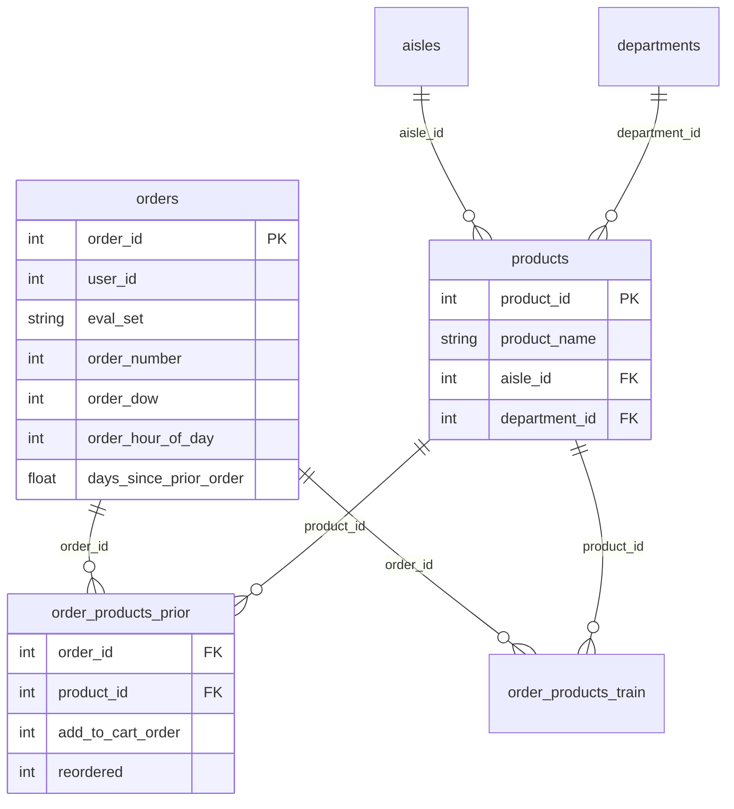
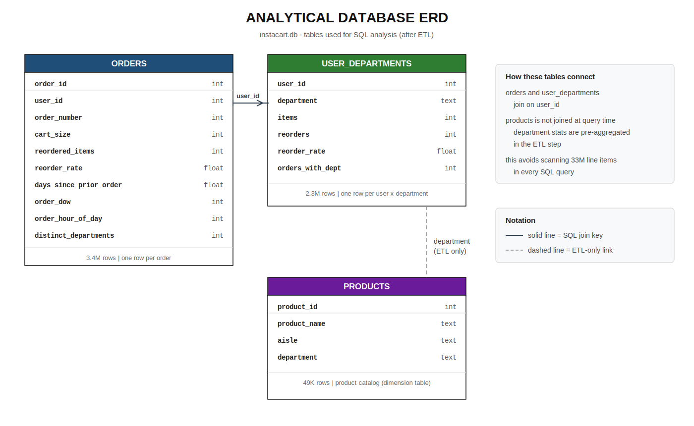
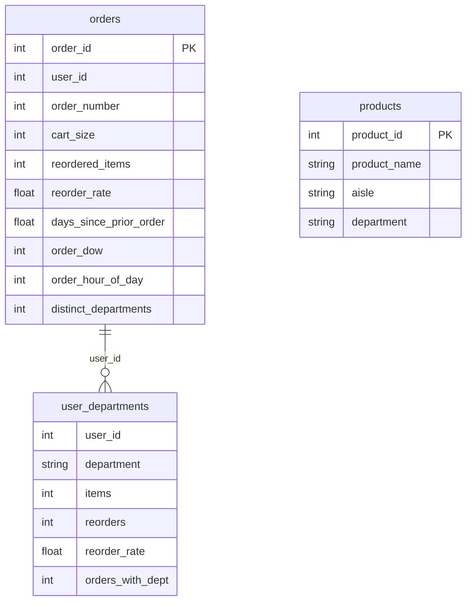

# Instacart Customer Behavior Case Study

## Business Question

**Instacart wants to know which customers are at risk of churning, and what product categories drive repeat purchases.**

This analysis uses SQL on 3.4 million orders from 206,209 users to:
1. Flag customers whose ordering gap has grown beyond their personal norm (churn risk)
2. Identify which grocery departments have the highest repeat-purchase rates (retention levers)

Every query below exists to answer one of those two questions — not to explore data for its own sake.

---

## Key Findings & Recommendations

### 1. 22.8% of customers show churn signals on their latest order

**Finding:** 47,109 users (22.8%) placed their most recent order after a gap that is **1.5× or more** their historical average. These customers haven't left yet, but their behavior is diverging from their norm.

**Recommendation:** Instacart should trigger a re-engagement email or push notification for this ~23% cohort — offering a staple-item discount in their most-reordered department — before they fully lapse.

---

### 2. Dairy, beverages, and produce drive repeat purchases

**Finding:** Staple departments lead on reorder rate: **dairy & eggs (67.0%)**, **beverages (65.4%)**, **produce (65.1%)**. Low-reorder categories include **personal care (32.2%)** and **pantry (34.7%)**. Overall reorder rate is **59.0%**.


**Recommendation:** Build replenishment reminders and "buy again" prompts around high-reorder staples. For low-reorder categories, use discovery-focused recommendations instead of replenishment flows.

---

### 3. Heavy shoppers reorder at 2.3× the rate of light shoppers

**Finding:** Users with 16+ orders reorder **67.0%** of items. Users with only 4–6 orders reorder **28.6%**. The jump happens between the "regular" tier (7–15 orders, 44.5%) and heavy tier.

**Recommendation:** Focus onboarding incentives on orders 4–7 to push light shoppers into habitual reorder behavior before they plateau.

---

### 4. Retention drops sharply after order 5

**Finding:** 100% of users reach order 4, but only **88.4%** reach order 5 and **53.7%** reach order 10. The steepest drop is between orders 4 and 5.

**Recommendation:** Introduce a milestone reward at order 5 (free delivery, category discount) to reduce early-stage attrition.

---

### 5. 47,804 users are in the "Lapsed" RFM segment

**Finding:** RFM segmentation (recency, frequency, monetary volume) places **23.2%** of users in the Lapsed segment — long gaps between orders despite prior activity.

**Recommendation:** Combine RFM Lapsed tagging with the 1.5× gap rule from Finding 1 to prioritize win-back campaigns by expected lifetime value.

---

## Methodology

### Data source

[Instacart Market Basket Analysis](https://www.kaggle.com/c/instacart-market-basket-analysis) — 3.4M orders, 33.8M order line items, 49,688 products, 21 departments.

Raw CSVs live in `../Instacart/`. Python ETL aggregates line items into analytical tables loaded into SQLite (`data/instacart.db`).

### Assumptions

| Assumption | Rationale |
|---|---|
| **Prior + train order products combined** | Both files are needed for complete order history. The train/test split was designed for ML prediction, not behavioral analysis. |
| **No revenue data** | Instacart dataset has no prices. "Monetary" in RFM = total items purchased, not dollars. |
| **No calendar dates** | Dataset uses `days_since_prior_order` and `order_number` instead of timestamps. Cohort analysis uses order-sequence milestones, not calendar months. |
| **Minimum 4 orders per user** | The public dataset only includes users with repeat purchase history (min 4 orders). Single-order churn cannot be measured. |
| **Churn proxy = 1.5× gap rule** | A customer's latest inter-order gap exceeding 150% of their historical average is used as a leading churn indicator, since we cannot observe true post-dataset churn. |
| **Reorder rate validation** | Every rate is computed as `reordered_items / cart_size` at order level. Rates are validated to stay within 0–100% to catch join blowups. |

### Analytical approach

```
Schema verification → Baseline sanity checks → Repeat purchase analysis → Churn risk → Segmentation
```

Queries are in [`sql/`](sql/) and follow this progression deliberately. Part A must pass before Part D results are trusted.

---

## Entity Relationship Diagrams

This project uses **two different schemas** at two different stages. Both are correct — they answer different questions.

### Why are there two ERDs?

| | Raw source ERD | Analytical ERD |
|---|---|---|
| **Shows** | Original Kaggle CSV files | SQLite tables after ETL |
| **Like** | Grocery store inventory system | Manager's weekly report |
| **Grain** | One row per item scanned (33.8M line items) | One row per order, or per user × department |
| **Purpose** | Store every transaction | Answer business questions fast |
| **Used by** | Data engineers loading data | Analysts writing SQL |

```
Raw Kaggle CSVs  →  [ETL pipeline]  →  Analytical SQLite DB  →  SQL queries
     ↑                                        ↑
  Raw ERD                              Analytical ERD
```

**What the ETL changes:**

| Raw table | Problem for analysis | What we built |
|---|---|---|
| `order_products__prior` + `order_products__train` (33.8M rows) | Too large for SQLite; slow joins | Aggregated into `orders` (cart_size, reorder_rate) and `user_departments` |
| `products` + `aisles` + `departments` (3 tables) | Requires joins every query | Flattened into one `products` table; department stats pre-aggregated into `user_departments` |
| No user-level summary | Every query would re-scan 33M rows | Pre-built `user_departments` at user × department grain |

---

### 1. Raw source data (Kaggle CSVs)

This is how Instacart published the data. Six tables, fully normalized.


**Key relationships:**
- `orders` → `order_products__prior` and `order_products__train` on `order_id`
- `products` → both order-product tables on `product_id`
- `aisles` → `products` on `aisle_id`
- `departments` → `products` on `department_id`

**Important nuances:**
- An order appears in **either** `prior` or `train`, not both (based on `eval_set`)
- `test` orders have no rows in either order-products table
- There is **no `users` table** — `user_id` is a column in `orders` only

<details>
<summary>Mermaid version (raw source)</summary>



</details>

---

### 2. Analytical database (SQLite — `instacart.db`)

Built by the Python ETL pipeline. Line items are aggregated to keep queries fast.



**Join keys:**
- `orders.user_id` → `user_departments.user_id` (one user, many orders and many department rows)
- `products` is a standalone dimension table — department info is pre-aggregated into `user_departments` at ETL time, so analysis queries do not need 33M-row joins

<details>
<summary>Mermaid version (analytical)</summary>



</details>

---

## SQL Files

| File | Purpose | When to run |
|---|---|---|
| [`sql/00_schema_exploration.sql`](sql/00_schema_exploration.sql) | Row counts, sample rows, null checks, join integrity, reorder rate bounds | **First** — before any analysis |
| [`sql/analysis_queries.sql`](sql/analysis_queries.sql) | 13 queries in 5 parts: sanity → baseline → repeat drivers → churn → segmentation | After schema checks pass |

Each query includes a **WHY** comment explaining the business purpose and a **VALIDATION** note with expected ranges.

---

## How to Run

### Prerequisites

- Python 3.10+
- Instacart raw CSVs in `../Instacart/`

### Setup

```bash
cd Customer-Behavior-Case-Study
python3 -m venv .venv && source .venv/bin/activate
pip install -r requirements.txt
bash run_pipeline.sh          # ETL (~6 min) + build DB + chart
```

### Run SQL

```bash
# Step 1: Verify schema
sqlite3 data/instacart.db < sql/00_schema_exploration.sql

# Step 2: Run analysis
sqlite3 data/instacart.db < sql/analysis_queries.sql
```

### Verify data loaded

```sql
SELECT COUNT(*), COUNT(DISTINCT user_id) FROM orders;
-- Expected: 3421083 | 206209
```

---

## Project Structure

```
Customer-Behavior-Case-Study/
├── README.md                          ← business question + findings + ERDs
├── assets/
│   ├── erd_raw_instacart.png          ← raw Kaggle source ERD
│   ├── erd_analytical_instacart.svg   ← analytical SQLite ERD (after ETL)
│   └── reorder_rate_by_department.svg ← key visual
├── sql/
│   ├── 00_schema_exploration.sql      ← run first
│   └── analysis_queries.sql           ← 13 queries, 5 parts
├── scripts/
│   ├── 01_clean_data.py               ← ETL from raw Instacart CSVs
│   ├── 02_build_sql_db.py             ← load SQLite
│   └── 03_generate_chart.py           ← department reorder chart
├── data/
│   └── instacart.db                   ← analytical database
└── run_pipeline.sh
```

---

**Author:** Akanksha Shukla · **July 2026**

**Dataset:** [Instacart Market Basket Analysis (Kaggle)](https://www.kaggle.com/c/instacart-market-basket-analysis)
